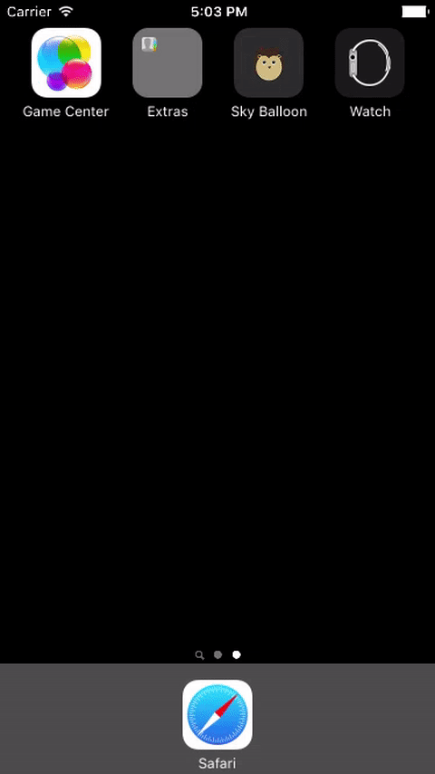

# Sky Balloon
An iOS platformer game that Ania Bui and I developed for Dr. Naumov's CS254: Software Development at Illinois Wesleyan University.

## Goals
 - Simple and easy-to-play
 - "Cute" graphics
 - User-friendly interface

## Inspiration
 - The main character is a hedgehog - a nocturnal animal who loves watermelon and is a natural prey for owls.
 - The two-phase mechanism from [Ninja Fishing](https://itunes.apple.com/us/app/ninja-fishing/id445283501?mt=8) (trying to cast your line as deep as possible then catch fishes while reeling up)
 - The control mechanism from [Sky Chasers](https://itunes.apple.com/us/app/sky-chasers/id1038866266?mt=8) (hold on the left side of screen to steer left and vice versa)
 - Ray Wenderlich's [SpriteKit Tutorials](https://www.raywenderlich.com/87231/make-game-like-mega-jump-sprite-kit-swift-part-1)

## Description
### Phase I

 - The hedgehog is shot up into the sky and has to collect the balloons on the way. 
 - The speed and the angle is determined by touching to stop the vertical and horizontal slider, correspondly.
 - The balloons he caught on the way are equivalent to the number of lives the character has.

### Phase II

 - Once the hedgehog has reach its height peak (speed = 0) it starts to fall down
 - The user navigates the hedgehog by holding the left/right side of the screen to steer left/right
 - The goal is to collect as many pieces of watermelon as possible and avoid owls
 - Any collision with the owls will result in losing a life
 - The game ends when either the hedgehog runs out of lives or the hedgehog reaches the ground

## Current status
The game is still under testing and I personally think it needs to be more polished (in terms of instructions for players, leaderboard integration, etc.) in order for it to be published.

Publish date: TBD

